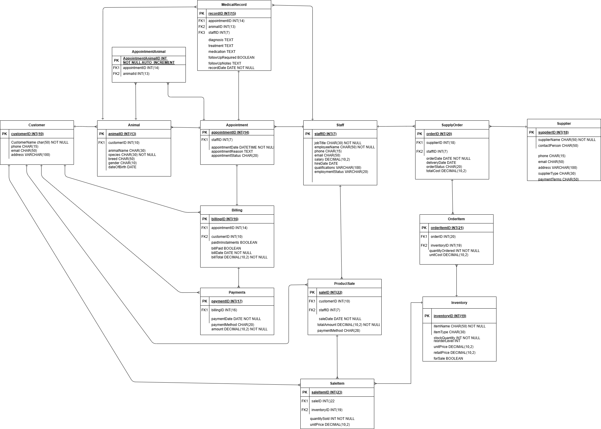

# MySQL-Database-Veterinary-Clinic-Database

A relational database system designed to manage the full operations of a veterinary practice - from animal care and appointments through to billing, inventory, retail sales and staff management.

## Project Overview

This database was built to handle the day-to-day and business-level operations of a veterinary clinic serving both domestic pets and farm animals across Dublin and Wicklow. The system covers clinical operations, financial management, inventory control, retail sales and staff administration within a single integrated database.

## Technologies

- **Database:** MySQL 8.0
- **Tools:** MySQL Workbench / phpMyAdmin
- **SQL Features:** JOINs, Subqueries, Aggregate Functions, Views, Indexes, GRANT permissions.

## Database Structure

The database is made up of 13 tables organised across four business areas:

## Database Diagrams

### Entity Relationship Diagram


### Clinical Operations

- **Staff** - All clinic staff with roles,contact information, qualifications, salary information, hire date and current working status.
- **Customer** - Pet owners and farm clients details including contact information.
- **Animal** - All animals registered at the clinic (domestic pets and farm animals)includes animal details such as species, gender and date of birth.
- **Appointment** - Scheduled and completed visits details such as reason for appointment,animal and customer details and assigned veternarian.
- **MedicalRecord** - Animals medical history including diagnosis, treatments and medications.

### Finance

- **Billing** - Invoices generated from appointments, tracks payment status and installment arrangements.
- **Payment** - Individual payment transactions linked to bills.

### Inventory and Retail

- **Supplier** - External suppliers for medical and retail stock details including contact information and payment terms.
- **Inventory** - All products stocked by the clinic, both for clinical use and retail sale.
- **SupplyOrder** - All order details placed with suppliers.
- **OrderItem** - Individual item details within each supply order.
- **ProductSale** - Retail sales to customers.
- **SaleItem** - Individual items within each sale details.

### Key Design Decisions

- Farm animals are stored in the same Animal table as domestic pets, distinguished by the species column. Farm animals use industry-standard identification codes (e.g. WX26838) while domestic pets are stored by name.
- Inventory tracks both clinical supplies and retail products in one table, with the forSale flag separating them.
- Billing supports both full payments and installment arrangements through the relationship between Billing and Payment tables.

## Views

The database includes views for both business management and day-to-day operations:

### Business Management
- **vw_FinancialOverview** - Calculates total revenue against total expenses to show overall profitability. Intended for the practice manager and business owner only.
- **vw_StaffDirectory** - Staff contact and role information without salary data and qualifications. Accessible to all staff.

### Day-to-Day Operations
- **vw_TodaysAppointments** - Filters appointments to today's schedule only. Used by receptionists to for quick look up to manage the daily workflow.
- **vw_ReorderAlert** - Shows only inventory items that have fallen below their reorder level. Used by the supplies administrator.
- **vw_OutstandingBills** - Shows all unpaid bills with the amount still owing, including partial payments made under installment agreements. Used by the billing administrator.

## Security and Data Protection

The database is designed for deployment on a local server within the clinic, with security focused on role-based access control to protect sensitive patient and financial data.

**Role-Based Permissions:**
- Veterinary administrators have full access to MedicalRecord (SELECT, INSERT, UPDATE)
- Veterinarians have read access to MedicalRecord for consultation
- Reception staff can manage Customer, Animal, Appointment, and ProductSale tables
- Billing administrators can manage Billing and Payment tables
- Supplies administrators can manage Inventory, SupplyOrder, and OrderItem tables
- Salary information is protected through the vw_StaffDirectory view (excludes salary data)
- Financial overview (vw_FinancialOverview) is restricted to manager/business owner access only

**Local Server Architecture:**
- Database runs on clinic's internal network
- All staff computers connect to central server
- No remote access required, enhancing data security
- Patient and financial data remains on-site

## Getting Started

git clone https://github.com/MKNaughton/MySQL-Database-Veterinary-Clinic-Database.git
cd MySQL-Database-Veterinary-Clinic-Database

### Prerequisites
- MySQL Server (5.7 or higher)
- MySQL Workbench or phpMyAdmin

### Setup

1. Clone the repository
```bash
git clone https://github.com/MKNaughton/veterinary-clinic-database.git
cd veterinary-clinic-database
```

2. Run the schema to create the database and tables
```bash
mysql -u root -p < database_schema.sql
```

3. Load the sample data
```bash
mysql -u root -p VeterinaryClinic < database_data.sql
```

4. Run the queries
```bash
mysql -u root -p VeterinaryClinic < queries.sql
```

### Using MySQL Workbench
1. Connect to your local MySQL server
2. Open and run database_schema.sql
3. Open and run database_data.sql
4. Explore the database using queries.sql

## Author

Marykerin Naughton
